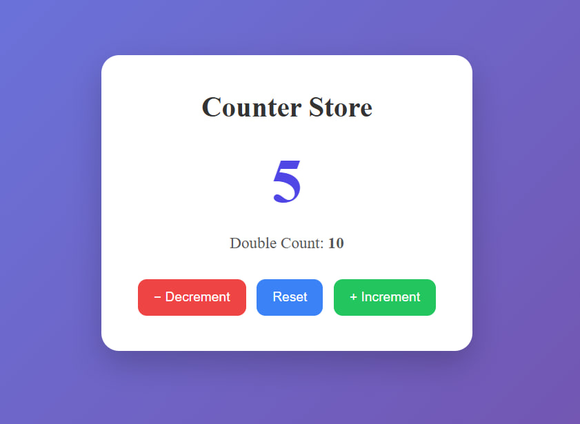
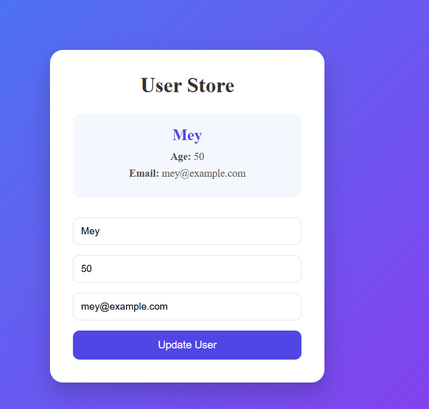
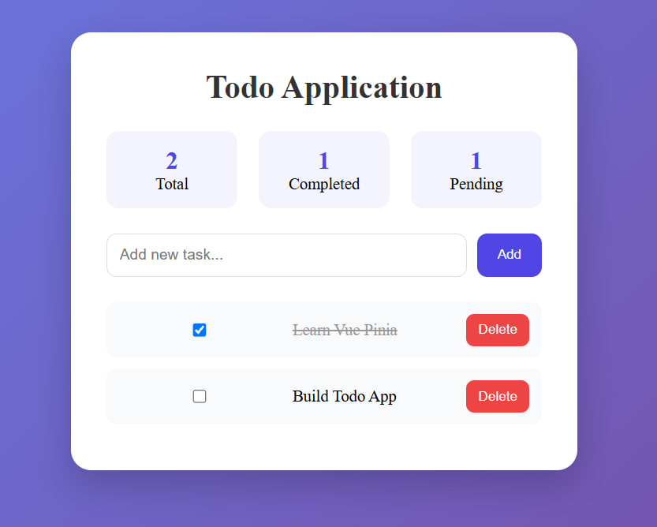
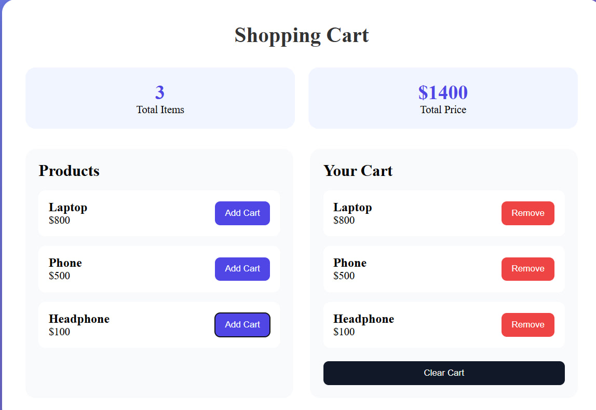
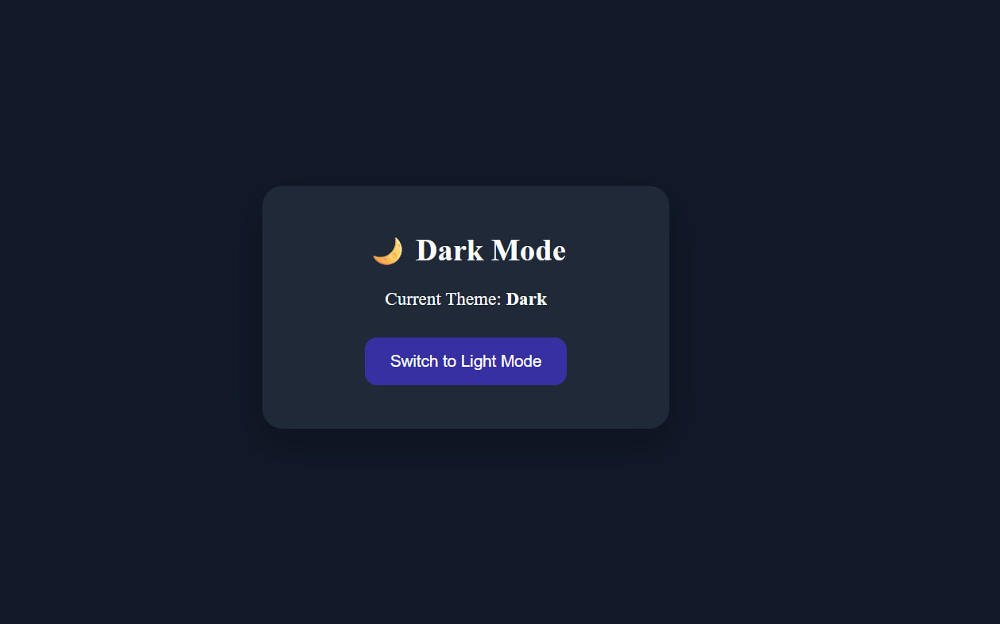
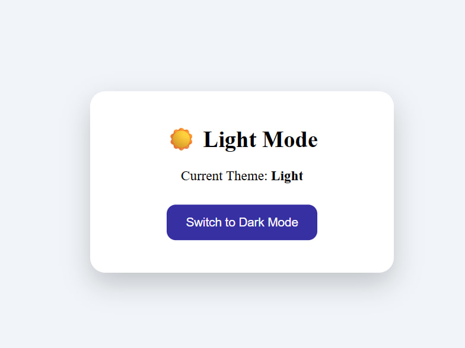

# 📸 Screenshots
## Exercise 1: Counter Store
A simple counter application using Pinia state management.

## Exercise 2: User Store
Manage user information including name, age, and email.

## Exercise 3: Todo List
Create, complete, and delete todos while displaying statistics.

## Exercise 4: Shopping Cart
Add and remove products from the shopping cart and calculate totals.

## Exercise 5: Theme Store
Switch between Light Mode and Dark Mode using Pinia.

